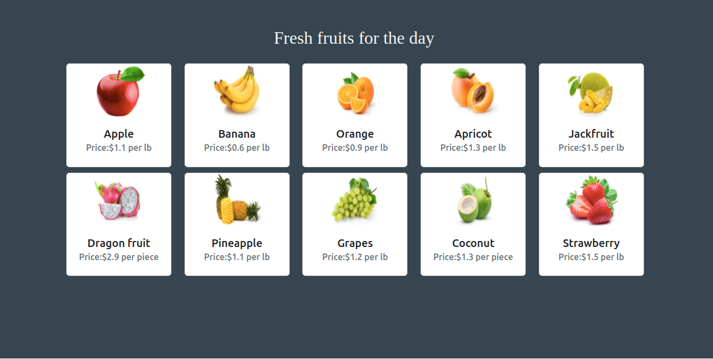

# Display Fruits in Fruit Fantasy App

## Context

Local fruit vendor Fruit Fantasy in San Francisco sells a variety of fruits to a large number of regular clients. Fruit supply and cost, however, are subject to daily market price fluctuations. To enable clients to observe the fresh fruits that were offered and their costs, the vendor created an app. This will enable them to provide better client service and the best products in terms of quality, advantages, flavor, and taste.​

Design a web page using TypeScript to display the fresh fruits from the database using fetch API. The fruits must be displayed in a way that the content is easy to scan

### Problem Statement

Build a web page using TypeScript which displays the fruits from the json-server using fetch API.​
The fruits must be displayed as cards as shown in the image below:

### Tasks

#### Task 1: Design the Fruit Fantasy web page. 

- Add header in `index.html` file to specify the title "Fresh fruits for the day".​
- Styles can be added inside `public/css/style.css` file​.
- Use onload event within the body tag to call getFruits() function to populate the fruits.
- Add a `
` container whose content should be dynamically loaded with the fruits.​
- Give the path as `public/js/app.js` inside the script tag of the `index.html`.​

#### Task 2: Create Fruit object
- Inside `app.js`, create an object type called `Fruit` with the attributes: id, name, image, unit and price: to define the fruit.​

#### Task 3: Retrieve fruits using Fetch API
- Inside `app.js`, define `getFruits()` function to retrieve all the fruits from the JSON server using fetch API `GET` method.
- Handle the response (success and failure) from the Fetch API.​
    - Call the transform() function with the data received for the successful response.​
    - Display an error message on failure.​

#### Task 4: Transform each fruit data 
- Inside `app.js`, define `transform()` function which loops through each fruit data retrieved as response to create a new object called `transformedFruit` that mirrors the object `Fruit` by mapping individual properties.​
- Within the for loop, call `showFruits()` function and pass `transformedFruit` as an argument to it.​

#### Task 5: Display the fruits as cards

- Inside `showFruits()` function, 
    - Declare a constant of HTMLElement type to represent  the `
` container element.​
    - Create a string object which contains HTML code to display each fruit as a card using the transformedFruit object. 
        - Use bootstrap class to style the card. ​
        - Additional styling can be provided inside `solution/public/css/style.css`.​
    - Append this string to the `
` container using its `innerHTML` property.​

### Font and Color Details
Fonts used:
- 'Times New Roman', 'Times', 'serif' (Heading)

Color codes used:
- Gray (Body background)
- whitesmoke (Heading)

### Execution Steps for the Practice​

Once the solution is completed, following steps must be performed to compile and execute the solution code.
- Open the terminal and give the command `npm run build` to compile `.ts` files and verify the converted files are located inside `solution/public/js` folder.
- Open another terminal and give the command `json-server solution/json/fruits.json` to start the json-server.
- Open the `index.html` file using Live Server and test the expected output.​

**Note: This is a test enabled challenge. Hence, the solution will have to undergo an automated evaluation process. The steps to test locally and on hobbes are given in the upcoming slides.**

### Test the Soluiton locally
Steps to test the code locally:

    1. Ensure the solution code is provided in the specified files only.
    2. From the command line terminal, set the path to the folder containing cloned boilerplate code.
    3. Run the command `npm install` to install the dependencies.
    4. Run the command `npm run test` to test the solution locally.
    5. Ensure all the test cases are passing locally 
    6. Refactor the code if the test cases are failing and re-run to test again.​
    7. Finally, push the solution to git for automated testing on `hobbes`.

### Test the solution on Hobbes
Test the solution on hobbes after pushing the code to git.

    1. Open the submission page at `https://codereview.stackroute.niit.com/#/submission`.
    2. Submit the solution.
    3. For the failed test cases, refactor the code locally and submit it for re-evaluation.

 ​

